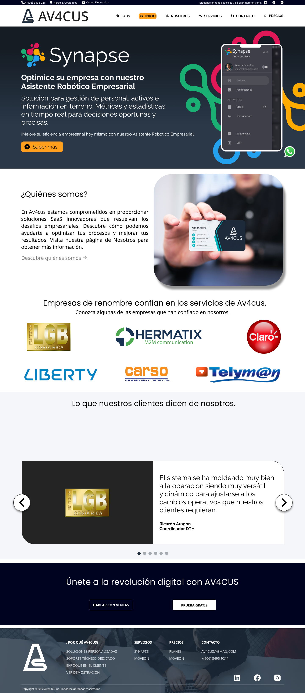
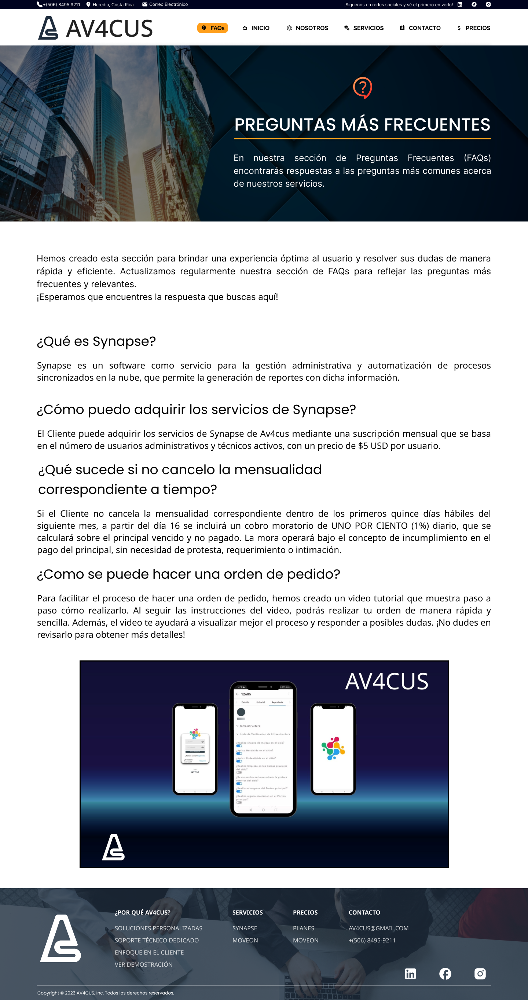
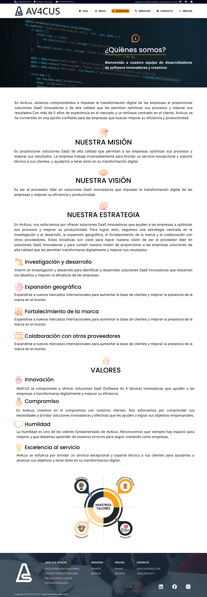
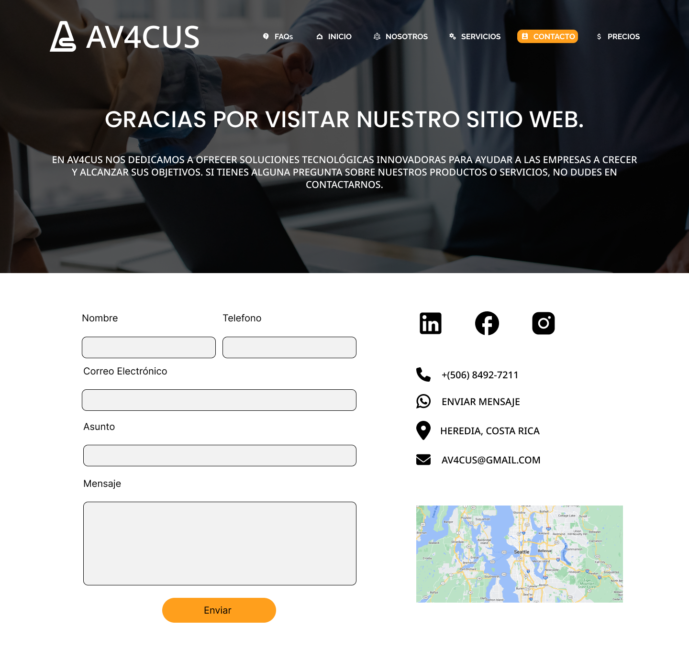
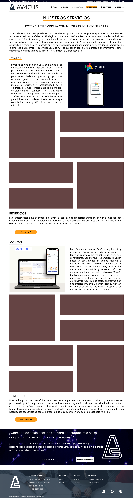

# Av4cus

## Description

This is the Av4cus project, a software company that offers SaaS business solutions. The project has been developed using ReactJS, styled-components, and other modern web technologies.

## Mokups 

### Home Page

### FAQs Page

### About Page

### Contact Page

### Services Page

## Features
* Responsive Design
* Frequently Asked Questions (FAQs) section
* Detailed information about the services offered
* Contact section with a submission form

## Contribution
If you wish to contribute to the project, you can do so through Pull Requests. Make sure to include a detailed description of the changes and tests performed.

## Authors
Luis Alfonso Rodríguez Fallas

## License
This project is under the Private License.